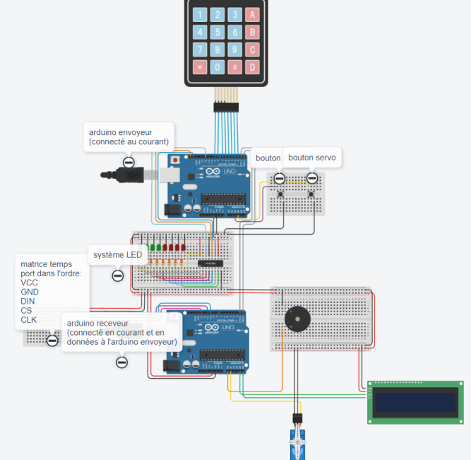

# Bombe Arduino (Escape Game)

Composant central d'un escape game : Le but est de désamorcer une bombe avant la fin d'un compte à rebours. 
Le code a saisir est à découvrir avec les énigmes présentent dans la salle.
  
Le montage repose sur **deux Arduino Uno** qui communiquent en série.



## Démonstration vidéo

| | | |
|---|---|---|
| [Vidéo 1](videos/demo-1.mp4) | [Vidéo 2](videos/demo-2.mp4) | [Vidéo 3](videos/demo-3.mp4) |

## Rôle des deux cartes

| Carte | Sketch | Rôle |
|---|---|---|
| **Envoyeur** | `arduino-envoyeur-escapeGame.ino` | Lit le clavier (clavier matriciel) et les deux boutons, vérifie le code saisi, pilote le bandeau de LED décoratif. Envoie les événements de jeu à l'autre carte via le port série. |
| **Récepteur** | `arduino-receveur-escapeGame.ino` | Reçoit les événements et pilote l'affichage : écran LCD (messages de statut), matrice de LED 32×8 (compte à rebours), servo-moteur et buzzer (jingles de succès / erreur / victoire / défaite). |

Les deux cartes sont reliées par leurs broches TX/RX (liaison série matérielle, 9600 bauds) et partagent le même bandeau de LED (voir `schemas/schema_envoyeur.png` et `schemas/schema_receveur.png`).

## Déroulé d'une partie

1. Au démarrage, le LCD affiche « Entrer code : » et le compte à rebours démarre sur la matrice de LED (1h par défaut).
2. Une fois le code obtenu ailleurs dans l'escape game, le joueur le saisit sur le clavier de la bombe :
   - **Code correct** → LCD « Code correct », jingle de succès, puis commande `servoZero` envoyée 2 s plus tard.
   - **Code incorrect** → LCD « Code incorrect », jingle d'erreur, saisie réinitialisée.
3. Une fois le bon code validé, le joueur appuie sur le **bouton de fin** : la bombe est désamorcée, jingle de victoire, le compte à rebours se fige, le bandeau de LED reste allumé fixe.
4. Si le temps imparti s'écoule avant la désactivation, un jingle de défaite est joué et le récepteur se bloque (fin de partie).
5. Un appui sur le **bouton servo** pendant que la bombe est désamorcée réarme complètement le montage (code, chrono, LED, sons) pour la session suivante, sans avoir à réinitialiser les cartes manuellement.

### Protocole série (envoyeur → récepteur)

| Message | Déclencheur | Effet sur le récepteur |
|---|---|---|
| `goodCode` | Code correct saisi | LCD « Code correct » + jingle de succès |
| `wrongCode` | Code incorrect saisi | LCD « Code incorrect » + jingle d'erreur |
| `servoZero` | 2 s après un code correct | Commande du servo (position 0) |
| `winGame` | Bouton de fin pressé après un code correct | Jingle de victoire + arrêt du compte à rebours |
| `servoNine` | Tant qu'aucun code correct n'est validé | Commande du servo (position 90) |

## Matériel nécessaire

- 2 × Arduino Uno
- 1 × clavier matriciel 4×4
- 1 × écran LCD 16×2 avec module I2C (adresse `0x27`)
- 1 × matrice de LED 32×8 à base de MAX7219 (4 modules, type `FC16`)
- 1 × registre à décalage 74HC595 + 8 LED
- 1 × servo-moteur
- 1 × buzzer actif
- 2 × boutons poussoir (bouton de fin, bouton servo)

Câblage détaillé de chaque carte : `schemas/schema_envoyeur.png` et `schemas/schema_receveur.png`.

## Bibliothèques Arduino requises

À installer via le gestionnaire de bibliothèques de l'IDE Arduino :

- [`Keypad`](https://www.arduinolibraries.info/libraries/keypad) (envoyeur)
- [`MD_Parola`](https://github.com/MajicDesigns/MD_Parola) et [`MD_MAX72xx`](https://github.com/MajicDesigns/MD_MAX72XX) (récepteur, matrice de LED)
- [`LiquidCrystal_I2C`](https://github.com/johnrickman/LiquidCrystal_I2C) (récepteur, écran LCD)
- `SPI` (incluse avec l'IDE Arduino)

## Installation

1. Câbler les deux montages selon les schémas fournis.
2. Ouvrir `arduino-envoyeur-escapeGame.ino`, installer `Keypad`, téléverser sur le premier Arduino Uno.
3. Ouvrir `arduino-receveur-escapeGame.ino`, installer `MD_Parola`, `MD_MAX72xx` et `LiquidCrystal_I2C`, s'assurer que `Font_Data.h` (police 7 segments pour l'affichage du chrono) est dans le même dossier, téléverser sur le second Arduino Uno.
4. Relier les broches TX/RX des deux cartes entre elles ainsi que les GND communs.

## Configuration

Deux paramètres codés en dur, à ajuster selon les besoins de la salle :

- **Code attendu** — dans `arduino-envoyeur-escapeGame.ino` :
  ```cpp
  if (strcmp(code, "2473") == 0) {
  ```
  Remplacer `"2473"` par le code (toujours 4 caractères) livré au joueur par l'énigme en amont.

- **Durée du compte à rebours** — dans `arduino-receveur-escapeGame.ino` :
  ```cpp
  const unsigned long GAME_DURATION_MS = 3600000UL;  // 1h
  ```

## Structure du dépôt

| Fichier | Rôle |
|---|---|
| `arduino-envoyeur-escapeGame.ino` | Sketch de l'Arduino clavier / boutons / bandeau de LED |
| `arduino-receveur-escapeGame.ino` | Sketch de l'Arduino LCD / matrice LED / servo / buzzer |
| `Font_Data.h` | Police 7 segments personnalisée pour la matrice de LED |
| `schemas/schema_entier.png` | Schéma de câblage complet du montage |
| `schemas/schema_envoyeur.png` | Schéma de câblage détaillé de l'Arduino envoyeur |
| `schemas/schema_receveur.png` | Schéma de câblage détaillé de l'Arduino récepteur |
| `videos/demo-*.mp4` | Vidéos de démonstration de la bombe |
